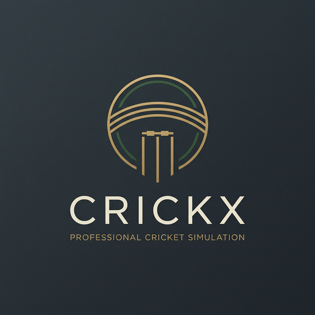

<div align="center">
  

# CrickX 🏏

**A 2D professional cricket simulation game — deep ball-by-ball simulation, a live visual field, and full match flows from quick hits to World Cup campaigns.**

[](https://github.com/uppalasrichaitanya/CrickX/actions/workflows/ci.yml)


</div>

> **Screenshots wanted:** this README has no screenshots yet — they must be captured from a running game (`F5` in the editor), which can't be done headless. A shot of the MatchHUD mid-over and one of the TournamentHub table would cover it.

## ✨ Features

### 🏏 Play your way
- **Quick Match** — pick two teams, T20 or ODI, and jump in. Three ways to play:
  - **Bat vs AI** — you bat, the AI handles the rest (auto-sim the chase with ⏩).
  - **Full Match** — bat the first innings, then pick every delivery as you bowl the second.
  - **Hot-Seat (2 Players)** — two humans, one device. Bowl picks lock behind a pass-the-device screen so the batting player only sees the delivery when they tap READY.
- **Tournament** — World Cup style: 2 groups of 4, live points table with Net Run Rate tie-breaks, semi finals and a final. Call the toss, choose to bat or bowl, pick your XI, and auto-sim the other fixtures. Tournaments **autosave after every result** and can be resumed or abandoned.
- **LAN Multiplayer** — host runs the authoritative simulation; the guest mirrors every ball and sends inputs back over ENet. A host-side watchdog AI-fills a silent peer so a dropout can never soft-lock the match.

### 🧠 Deep ball-by-ball simulation
Every delivery runs through `BallSimulator.gd`'s 8-module pipeline — form & fatigue, weather & pitch wear, match pressure, batting timing, bowling accuracy/swing/spin variations, AI decisions, DRS ball-tracking, and atmosphere/momentum:
- **Risk/reward batting** — Defensive Block, Leave, Drive, Pull, Sweep and all-out Slog, each with its own wicket/boundary profile, matchup matrix vs. delivery type, and timing grades.
- **DRS reviews** — challenge LBW and caught decisions (1 per T20 innings, 2 per ODI) with a 5-second window, ball-tracking, edge detection and umpire's call.
- **Contested fielding** — catches are taken (or dropped!) by real fielders based on skill and field settings, with proper dismissal text (`c Fielder b Bowler`).
- **Living conditions** — powerplay/middle/death phases, pitch wear, weather changes, drinks breaks, bowler rhythm and spells, momentum swings.
- **Super overs** — level T20 scores go to sudden death: 1 over per side, 2 wickets, chaser bats first, repeating until decided (shootout runs never touch NRR).

### 📺 Presentation
- **Live visual field** — a top-down TV-style oval renders every ball: per-delivery trajectories, boundary rope chases, sixes sailing over the top, shattering stumps, dropped catches, a toggleable **wagon wheel** (🧭) of every scoring shot, milestone fireworks, and phase-aware field placements.
- **Dynamic commentary** — context-aware, typewriter-animated lines for every outcome: milestones, hat-tricks, maidens, weather changes, DRS drama, close finishes.
- **Career records** — persistent per-player aggregates (runs, wickets, 50s/100s, best figures) across every match you play, with all-time tables.
- **Dark pro UI** — one central `CrickXTheme.tres`, tooltips on every control, click sounds, fade transitions on all 12 screens, fast-forward (⏩) anywhere.
- **Synthesized SFX** — bat cracks, crowd cheers, wicket bells and ambient loops, all generated offline by `tools/gen_audio.ps1` (no binary assets in the repo).

## 🛠️ Technology Stack

- **Game Engine**: Godot 4.2.2 stable
- **Language**: GDScript
- **Rendering**: 2D, `canvas_items` stretch, base resolution 1280×720
- **Netcode**: ENet high-level multiplayer (`NetworkManager.gd`, authoritative host)
- **CI**: GitHub Actions — editor import check, headless match suite, LAN loopback test

## 🚀 Getting Started

### Prerequisites

- Download and install [Godot Engine 4.2.2](https://godotengine.org/download/archive/4.2.2-stable/) or newer.

### Installation

1. Clone the repository:
   ```bash
   git clone https://github.com/uppalasrichaitanya/CrickX.git
   ```
2. Open the Godot Project Manager.
3. Click **Import**, browse to the cloned `CrickX` directory and select `project.godot`.
4. Click **Import & Edit** to open the project.

> First import builds the `.godot/` cache (untracked). If the editor ever reports stale import errors, close it, delete `.godot/`, and reopen.

### ⬇️ Download (no Godot needed)

Grab the latest release from the [Releases page](https://github.com/uppalasrichaitanya/CrickX/releases):
- **Windows** — download `CrickX-Windows.zip`, unzip, run `CrickX.exe`.
- **Linux** — download `CrickX-Linux.tar.gz`, extract, run `./CrickX.x86_64`.

Releases are built automatically by CI from version tags (`v*`) using Godot 4.2.2 release templates. Saves live in the OS user-data folder, so your tournament and career survive updates.

## 🎮 How to Play

1. Run the project from the Godot editor (`F5`).
2. From the **Main Menu**, choose **Quick Match**, **Tournament**, **Multiplayer** (hot-seat or LAN), **Records**, or **Settings**.

### Batting & bowling

| Input | Action |
|---|---|
| `1`–`6` | Pick a shot when batting (Drive / Pull / Sweep / Slog / Block / Leave) |
| `1`–`4` | Pick a delivery when bowling (depends on bowler: pace or spin menu) |
| `Enter`/`Space` | Confirm the hot-seat handoff (reveal the locked-in delivery) |
| ⏩ button | Fast-forward: collapse the waits between balls |
| 🧭 button | Toggle the wagon-wheel overlay |
| ✕ button | Quit the match (asks first — abandoned matches save no result) |

3. In **Team Select**, pick teams, format and mode — then pick your **playing XI** from the 15-man squad (order sets the batting order; at least one bowler required, auto-pick available).
4. Watch the **Delivery Alert** (e.g. `🏏 YORKER!`) — you have a **4-second reaction window** to choose your shot.
5. On an LBW/caught dismissal you get a **5-second DRS window** to challenge.
6. In tournaments, call the **toss** (win it and choose to bat or bowl), play your fixtures, sim the rest, and lift the cup through groups → semis → final.
7. Level T20 scores go to a **super over** — sudden death until someone wins.

### Tips
- Defensive shots survive pressure and swing; slogging into a yorker is how innings end.
- Watch bowler rhythm (🔥/💨) and batter form (🔥/❄️) on the HUD — they move the probabilities.
- Spin reads get harder late; pitch wear and humidity bring reverse swing and turn.

## 🏗️ Architecture

State flows one way: **Autoloads hold truth, scenes render it, signals decouple them.**

- `GameManager.gd` — the single source of truth: teams, players, score, overs, striker/bowler, weather, momentum, DRS counts, plus tournament-agnostic helpers (NRR inputs, partnership, run rates).
- `MatchEngine.gd` — the match state machine (`IDLE → WAITING_FOR_SHOT/BOWL → SIMULATING → SHOWING_RESULT → END_OF_OVER/INNINGS → MATCH_OVER`, plus DRS review and super-over branches). Every suspended coroutine carries a **generation token** (`_match_gen`) so stale flows from old matches abort instead of double-driving the sim. `abort_match()` uses the same mechanism for mid-match quits.
- `BallSimulator.gd` + 8 modules (`scripts/core/modules/`) — per-ball outcome pipeline: `FormFatigue`, `WeatherPitch`, `PressureMorale`, `BattingDepth`, `BowlingDepth`, `AIController`, `DRSSystem`, `AtmosphereSystem`. Pure functions of `(batsman, bowler, shot, delivery, state)` returning an outcome dictionary.
- `TournamentManager.gd` — groups, fixtures, standings/NRR, semis/final progression, autosave/resume via `SaveManager`.
- `CareerManager.gd` — per-player aggregates persisted to `user://saves/career.json`.
- `CommentaryManager.gd` — pool-based contextual commentary with anti-repeat memory.
- `AudioManager.gd` — pooled SFX players + volume buses (settings persist to `user://settings.cfg`).
- `NetworkManager.gd` — ENet host/join, lobby handshake, authoritative-host event broadcast + input RPCs, disconnect handling, send watchdog.
- `Constants.gd` — every enum, threshold, color, matchup matrix and field layout in one place.

### Project structure

```
CrickX/
├── autoloads/        # Singletons: GameManager, MatchEngine, Commentary/Audio/
│                     # Save/Network/Tournament/Career managers, Constants
├── scenes/
│   ├── ui/           # 11 screens: menu, select, XI picker, toss, HUD,
│   │                 #   scorecard, tournament hub, records, settings, lobby
│   └── match/        # FieldView: the visual pitch (pure _draw + tweens)
├── scripts/core/     # BallSimulator, TeamData, PlayerData, TeamDatabase + 8 modules
├── scripts/match/    # FieldView + MarkerDot view code
├── assets/audio/     # Synthesized WAVs (+ .import files) — see tools/
├── tools/            # gen_audio.ps1 — regenerates all SFX from scratch
├── tests/            # smoke_test.gd, net_host/net_client.gd, ui_smoke.gd
├── .github/workflows # CI: import check + match suite + LAN loopback
├── CrickXTheme.tres  # Central UI theme
└── project.godot     # Autoload order + input map + display settings
```

## 🧪 Testing

Everything below runs headless and gates CI (exit code 0 = green):

```bash
# Match suite: 9 full AI/human-scripted matches, DRS unit checks,
# super-over shootout, full auto-sim tournament + save/load round-trips
Godot_v4.2.2-stable_win64_console.exe --headless --path . -s res://tests/smoke_test.gd

# UI suite: instantiates all 12 scenes, asserts wiring (toggle modes,
# quit dialog, back paths) and the abort_match contract
Godot_v4.2.2-stable_win64_console.exe --headless --path . -s res://tests/ui_smoke.gd

# LAN loopback (two processes; also runs in CI):
Godot_v4.2.2-stable_win64_console.exe --headless --path . -s res://tests/net_host.gd -- --port=54123 &
Godot_v4.2.2-stable_win64_console.exe --headless --path . -s res://tests/net_client.gd -- --port=54123
```

CI (`.github/workflows/ci.yml`) additionally does a strict editor-import pass that fails on any `SCRIPT ERROR`, on every push and PR to `main`.

## 🛟 Troubleshooting

| Problem | Fix |
|---|---|
| Stale import / weird editor errors | Close editor, delete `.godot/`, reopen and reimport |
| LAN join fails | Same network (or loopback `127.0.0.1` for testing), default port `54000`, check firewall allows UDP |
| Headless test crashes on load | Ensure you run with `--path .` from the repo root so `res://` resolves |
| Settings not sticking | They save to `user://settings.cfg` on leaving the Settings screen |
| Opponent disconnects mid-match (LAN) | Host shows a connection-lost overlay and returns to menu; client does the same |

## 🤝 Contributing

- GDScript style: tabs, `snake_case`, one-line comment header per file, no emojis in code unless UI text.
- New engine states go in `MatchEngine.State`; every `await` resume point must check the `_match_gen` token.
- New UI scenes follow the `Control` + `theme_override_*` pattern (no `.tres` sub-resources — they break the text scene parser); every button gets a tooltip and a click sound; every screen gets a back path and a fade transition.
- Every feature lands with headless coverage in `tests/` and a README section.

## 📜 License

This project is open-source under the MIT License — see [LICENSE](LICENSE).
